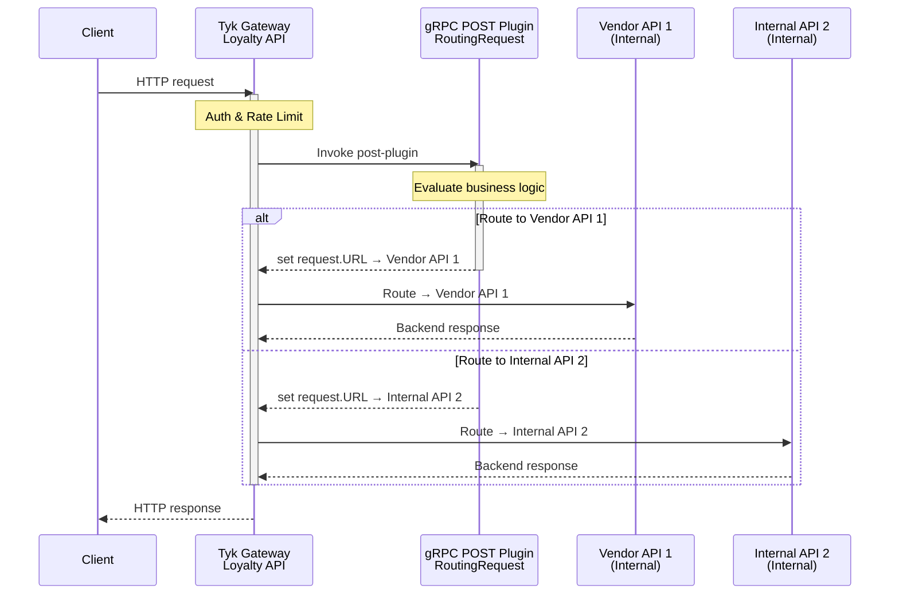

# gRPC-routing Plugin Example
Example showing how a gRPC plugin can route requests to Tyk Internal APIs using the tyk:// scheme


#### Architecture

This is a Tyk gRPC coprocess plugin — an ASP.NET Core gRPC server targeting .NET 10. Tyk Gateway calls this service over gRPC whenever a configured API hook fires which for this example is a `POST` hook.


Key source files:
- `routing-plugin/Services/DispatcherService.cs` — all plugin logic; implements `Dispatcher.DispatcherBase`
- `routing-plugin/Program.cs` — minimal startup: registers gRPC, maps `DispatcherService`
- `routing-plugin/appsettings.json` — Kestrel configured for HTTP/2 on port 5555

Tyk API definitions (OAS + `x-tyk-api-gateway` extensions):
- `tykoas-loyalty-api.yaml` — the entry-point API; has the gRPC post-plugin hook (`RouteRequest`) configured with `driver: grpc`
- `tykoas-internal-vendor-api-1.yaml` — internal-only API (`internal: true`) that the plugin routes to via the `tyk://` scheme


#### Request Flow


#### Commands to build and run gRPC Service

```bash
# Build
dotnet build

# Run (listens on http://0.0.0.0:5555 via HTTP/2)
dotnet run

# Publish release build
dotnet publish -c Release
```

#### API Setup and Usage
- Import both the `tykoas-loyalty-api.yaml` and `tykoas-internal-vendor-api-1.yaml` API Definitions to your environment
- Create an API KEY for access to the `tykoas-loyalty-api.yaml` API
- Make an API request to the `tykoas-loyalty-api.yaml` API

#### How it works

Tyk Gateway calls this service over gRPC whenever a configured API hook fires. The plugin implements the `Dispatcher` service defined in the Tyk coprocess protobuf contract.

Key files:
- `Services/DispatcherService.cs` — the single service class; all plugin logic lives here
- `Program.cs` — minimal startup: registers gRPC and maps `DispatcherService`
- `appsettings.json` — Kestrel is configured to listen on `http://0.0.0.0:5555` (HTTP/2 only)

#### Proto contract

The `.proto` files live in the `Protos` folder and are referenced  in the csproj. The important ones are:

| File | Purpose |
|---|---|
| `coprocess_object.proto` | Defines `Object` (the request/response envelope) and the `Dispatcher` service |
| `coprocess_common.proto` | Defines `HookType` enum (Pre, Post, CustomKeyCheck, etc.) |
| `coprocess_mini_request_object.proto` | `MiniRequestObject` — headers, URL, body, params |
| `coprocess_response_object.proto` | `ResponseObject` — upstream response fields |
| `coprocess_session_state.proto` | `SessionState` — auth session / key data |
| `coprocess_return_overrides.proto` | Override fields for short-circuiting the request |


#### Routing via `tyk://` URL scheme

The primary use case for this plugin is **internal API routing**. To forward a request to another Tyk-managed API, set `request.Request.Url` to a `tyk://` URL:

```
tyk://<API_ID>          # route to a specific API by its Tyk API ID
tyk://self/<path>       # route to the same API
```

This must be done inside the `Dispatch` override in `DispatcherService.cs`.

#### Hook dispatch pattern

`Dispatch` receives every hook call for every configured hook on the API. Branch on `request.HookType` (Pre, Post, CustomKeyCheck, Response, etc.) and/or `request.HookName` to apply logic selectively. Return the (possibly modified) `request` object to continue the request lifecycle.
